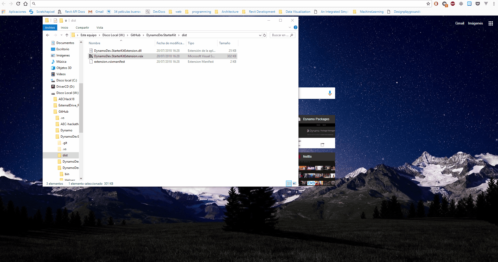
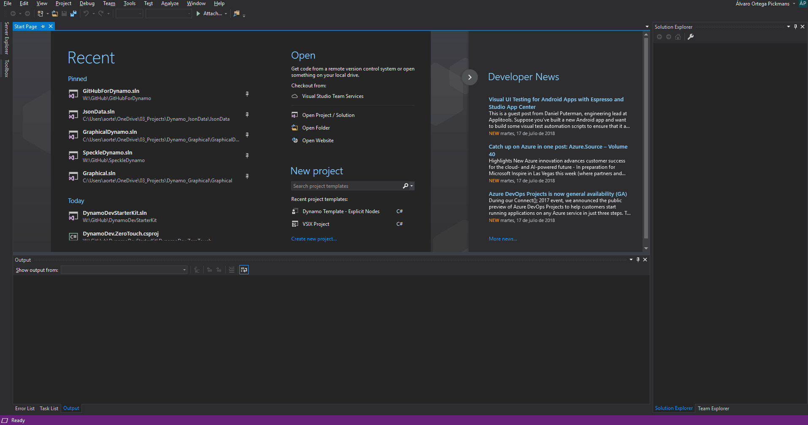

# Dynamo Development Starter Kit

<<<<<<< HEAD
The set up of a project aiming the [Dynamo](http://dynamobim.org/) platform can be hard and frustating if not use to it. This project is a Visual Studio Extension (VSIX) containing templates for the set up of Dynamo package projects, providing boilerplates so you can just start developing your stuff.
=======
The set up of a project aiming the [Dynamo](http://dynamobim.org/) platform can be hard and frustating if not used to it. This project is a Visual Studio Extension (VSIX) containing templates for the set up of [Dynamo](http://dynamobim.org/) package projects, providing boilerplates so you can just start developing your stuff.
>>>>>>> d9722fbee9d68ee12235ae503825fc2848415b86

## Getting Started

These instructions will get you started on how to install the VSIX and start developing your own Dynamo packages. 
*Bear in mind these templates are just one of many ways of setting up Visual Studio to seamlessly create a base structures.*

### Prerequisites

- [Visual Studio 2017](https://visualstudio.microsoft.com/downloads/)
- [Dynamo Visual Programming](http://dynamobim.org/download/)

### Installation

Having the project downloaded and Visual Studio totally closed, execute the `.vsix` file within the `dist` folder. This pops up a window that will install the extension along with templates.

### Usage

- Within Visual Studio, create a new project. Under Visual C#, you should have two new templates: `Dynamo Template - ZeroTouch` and `Dynamo Template - Explicit Nodes`.
- Fill in the parameters of your projects. The panel on the rigth displays a preview of the `pkg.json` file that will get generated.
- Once accepted, it will download all the necessary Dynamo Nuget packages and you'll be ready to go.

## License

This project is licensed under the MIT License - see the [LICENSE.md](LICENSE.md) file for details
