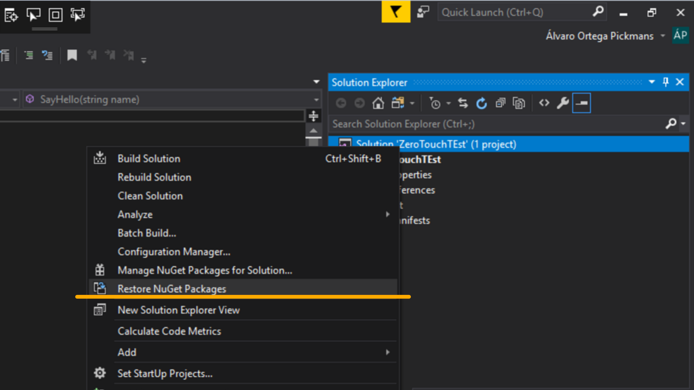

# Dynamo Development Starter Kit

The set up of a project aiming the [Dynamo](http://dynamobim.org/) platform can be hard and frustating if not use to it. This project is a Visual Studio Extension (VSIX) containing templates for the set up of Dynamo package projects, providing boilerplates so you can just start developing your stuff.

## Getting Started

These instructions will get you started on how to install the VSIX and start developing your own Dynamo packages. 
*Bear in mind these templates are just one of many ways of setting up Visual Studio to seamlessly create a base project scaffolding.*

### Prerequisites

- [Visual Studio 2017 or 2019](https://visualstudio.microsoft.com/downloads/)
- [Dynamo Visual Programming](http://dynamobim.org/download/)

### Installation

Having the project downloaded and Visual Studio totally closed, execute the `.vsix` file within the `/dist` folder. This pops up a window that will install the extension along with templates. You can also install the latest stable version by downloading the `.zip` bundle from the [latest release](https://github.com/alvpickmans/Dynamo-Dev-Starter-Kit/releases/latest) section.


### Usage

*Note: Bear in mind that the templates distributed on this extension are by no means mandatory and just represent my personal way of structuring projects. These templates can be modified when [building the extension from source](#building-from-source)*


- Within Visual Studio, create a new project. Under Visual C#, you should have three new templates: 
  - `Dynamo Template - ZeroTouch`
  - `Dynamo Template - Explicit Nodes`
  - `Dynamo Template - ViewExtension`
- Fill in the parameters of your projects. The panel on the rigth displays a preview of the `pkg.json` file that will get generated.
- Once accepted, it will generate a project scaffolding on the selected location.
- Required Dynamo Libraries are already define. In order to restore them, press right-click on the solution's tab and select `Restore Nuget Packages`. This will download them from NuGet and you'll be ready to go! Otherwise, these references will be restored the first time you build the solution.

- Finally when compiling, a package folder will be created at `{YourSolutionName}/dist/{YourProjectName}`. If configuration mode is on `Debug`, this package folder will be copied to the Dynamo packages folder, following the below snippet for the `AfterBuild` target or similar:

```xml
<PropertyGroup>
    <PackageName>Sample Project</PackageName>
    <VersionFolder>2.0</VersionFolder> 
    <PackageFolder>$(SolutionDir)dist\$(PackageName)\</PackageFolder>
    <BinFolder>$(PackageFolder)bin\</BinFolder>
    <ExtraFolder>$(PackageFolder)extra\</ExtraFolder>
    <DyfFolder>$(PackageFolder)dyf\</DyfFolder>
  </PropertyGroup>
  <Target Name="AfterBuild">
    <ItemGroup>
      <Dlls Include="$(OutDir)*.dll" />
      <Pdbs Include="$(OutDir)*.pdb" />
      <Xmls Include="$(OutDir)*.xml" />
      <Xmls Include="$(ProjectDir)manifests\*.xml" />
      <PackageJson Include="$(ProjectDir)manifests\pkg.json" />
    </ItemGroup>
    <Copy SourceFiles="@(Dlls)" DestinationFolder="$(BinFolder)" />
    <Copy SourceFiles="@(Pdbs)" DestinationFolder="$(BinFolder)" />
    <Copy SourceFiles="@(Xmls)" DestinationFolder="$(BinFolder)" />
    <Copy SourceFiles="@(PackageJson)" DestinationFolder="$(PackageFolder)" />
    <MakeDir Directories="$(ExtraFolder)" Condition="!Exists($(ExtraFolder))" />
    <MakeDir Directories="$(DyfFolder)" Condition="!Exists($(DyfFolder))"  />
    <CallTarget Condition="'$(Configuration)' == 'Debug'" Targets="PackageDeploy" />
  </Target>
  <Target Name="PackageDeploy">
    <ItemGroup>
      <SourcePackage Include="$(PackageFolder)**\*" />
    </ItemGroup>
    <PropertyGroup>
      <DynamoCore>$(AppData)\Dynamo\Dynamo Core\$(VersionFolder)\packages</DynamoCore>
      <DynamoRevit>$(AppData)\Dynamo\Dynamo Revit\$(VersionFolder)\packages</DynamoRevit>
    </PropertyGroup>
    <!--Copying to Package Folder-->
    <Copy SourceFiles="@(SourcePackage)" Condition="Exists($(DynamoCore))" DestinationFolder="$(DynamoCore)\$(PackageName)\%(RecursiveDir)" />
    <Copy SourceFiles="@(SourcePackage)" Condition="Exists($(DynamoRevit))" DestinationFolder="$(DynamoRevit)\$(PackageName)\%(RecursiveDir)" />
  </Target>
```


## Building from Source

In order to build the project from source, Visual Studio SDK must be [installed](https://msdn.microsoft.com/en-us/library/mt683786.aspx?f=255&MSPPError=-2147217396).
The solution has 4 projects:
- **DynamoDev.StarterKitExtension**: Handling the VSIX extension and contains the Package Definition window.
- **DynamoDev.ZeroTouch**: Contains the template to deploy a ZeroTouch package (not requiring custom UI).
- **DynamoDev.ExplicitNodes**: Contains the template to deploy a Dynamo package with nodes requiring UI customization.
- **DynamoDev.ViewExtension**: Contains the template to deploy a Dynamo ViewExtension.

On debugging, another instance of Visual Studion will open and the extension can be used.
On Release configuration mode, after being built the corresponding files will be copied to the `/dist` folder.

## License

This project is licensed under the MIT License - see the [LICENSE.md](LICENSE.md) file for details.
